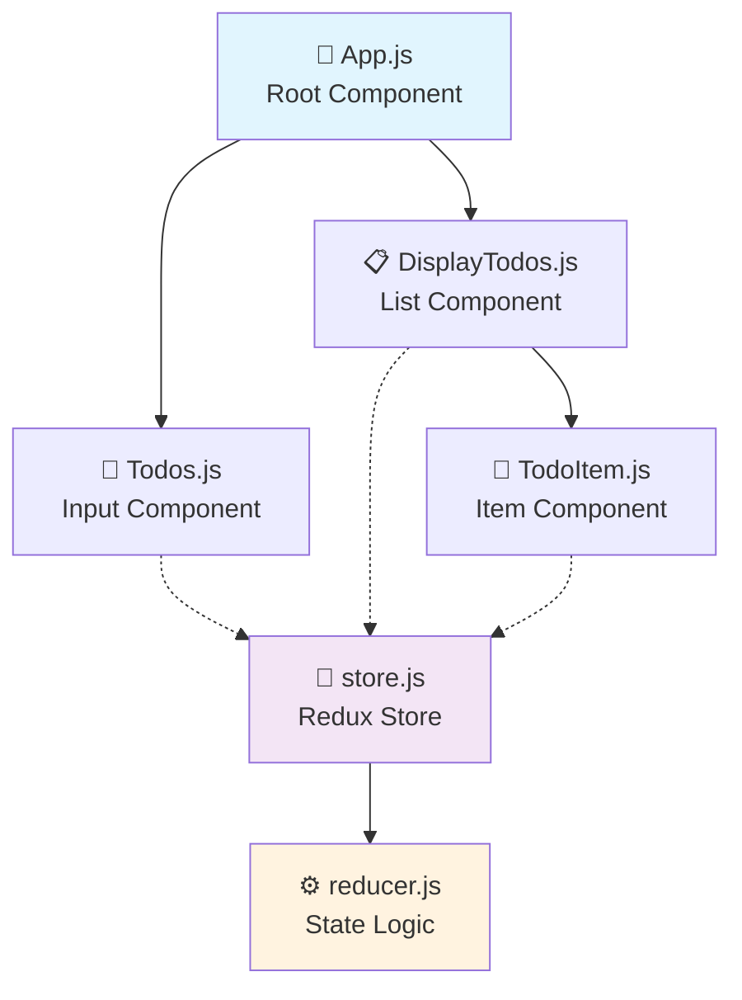

# 🚀 Redux ToDo App

<div align="center">


*A beautifully animated, modern todo application built with React & Redux* ✨

• [📖 Documentation](#) • [🐛 Report Bug](#) • [💡 Request Feature](#)

</div>

---

## ✨ Features

<table>
<tr>
<td width="50%">

### 🎯 Core Functionality
- ➕ **Add Todos** - Create new tasks instantly [1](#1-0) 
- 🗑️ **Remove Todos** - Delete completed tasks [2](#1-1) 
- ✏️ **Edit Todos** - Update task descriptions [3](#1-2) 
- ✅ **Complete Todos** - Mark tasks as done [4](#1-3) 

</td>
<td width="50%">

### 🎨 User Experience
- 🔍 **Smart Filtering** - View active, completed, or all todos [5](#1-4) 
- 🎭 **Smooth Animations** - Delightful hover & tap effects
- 📱 **PWA Ready** - Install as a native app
- 🎯 **Modern UI** - Clean, intuitive interface

</td>
</tr>
</table>

---

## 🛠️ Tech Stack

<div align="center">

| Technology | Version | Purpose |
|------------|---------|---------|
| ⚛️ **React** | ^17.0.2 | UI Framework [6](#1-5)  |
| 🔄 **Redux Toolkit** | ^1.9.1 | State Management [7](#1-6)  |
| 🔗 **React Redux** | ^7.2.3 | React-Redux Bridge [8](#1-7)  |
| 🎬 **Framer Motion** | ^4.1.3 | Animations [9](#1-8)  |
| 🎨 **React Icons** | ^4.2.0 | Icon Library [10](#1-9)  |

</div>

---

## 🚀 Quick Start

### 📦 Installation

```bash
# Clone the repository
git clone https://github.com/YuvrajsinhRaj/Redux-ToDo_app.git

# Navigate to project directory
cd Redux-ToDo_app

# Install dependencies
npm install
```

### 🏃‍♂️ Development

```bash
# Start development server
npm start
```
🌐 Open [http://localhost:3000](http://localhost:3000) to view in browser [11](#1-10) 

### 🏗️ Production Build

```bash
# Create optimized build
npm run build
```
📦 Generates optimized production bundle [12](#1-11) 

---

## 🏗️ Architecture



### 🧩 Core Components

- **🎯 App.js** - Root application container
- **📝 Todos.js** - Todo input and creation
- **📋 DisplayTodos.js** - Todo list with filtering [13](#1-12) 
- **📄 TodoItem.js** - Individual todo item renderer
- **🏪 store.js** - Redux store configuration [14](#1-13) 
- **⚙️ reducer.js** - State management with Redux Toolkit [15](#1-14) 

---

## 🔄 State Management

The application uses **Redux Toolkit** for predictable state management:

- 🎯 **Slice-based Architecture** - Clean, organized reducers [16](#1-15) 
- 📊 **Initial State** - Empty array for todos [17](#1-16) 
- 🚀 **Action Creators** - Auto-generated from slice [18](#1-17) 

---

## 🌐 Browser Support

<div align="center">

| Environment | Support |
|-------------|---------|
| 🏭 **Production** | >0.2%, not dead, not op_mini all |
| 🔧 **Development** | Latest Chrome, Firefox, Safari |

</div> [19](#1-18) 

---

## 🤝 Contributing

We welcome contributions! Please feel free to submit a Pull Request.

1. 🍴 Fork the repository
2. 🌿 Create your feature branch (`git checkout -b feature/AmazingFeature`)
3. 💾 Commit your changes (`git commit -m 'Add some AmazingFeature'`)
4. 📤 Push to the branch (`git push origin feature/AmazingFeature`)
5. 🔄 Open a Pull Request

---

<div align="center">

**Made with ❤️ by [YuvrajsinhRaj](https://github.com/YuvrajsinhRaj)**

⭐ Star this repo if you found it helpful!

</div>
